<div align="center">


</div>

---

## 🧑‍💻 About Me

<div align="center">


</div>

<br/>

<table align="center">
<tr>
<td valign="top" width="55%">

```js
const gaurav = {
  education : "Engineering Student",
  role      : "Full Stack Developer",
  stack     : ["React", "Node.js", "MongoDB", "Python"],
  AI_ML     : ["TensorFlow", "PyTorch", "OpenCV"],
  hardware  : ["Arduino", "Raspberry Pi", "Embedded C"],
  cloud     : ["AWS", "Azure", "GCP"],
  goal      : "Software Engineer @ Top Tech",
  email     : "kumbharegaurav100@gmail.com",
  funFact   : "I bridge hardware & software! 🔌⚡"
};
```

</td>
<td valign="top" width="45%">

<br/>

🚀 &nbsp;**Building** real-world projects daily
🌱 &nbsp;**Exploring** AI/ML integrations
🔌 &nbsp;**Bridging** embedded → cloud
🎯 &nbsp;**Goal** — Top Tech SWE role
💬 &nbsp;**Open to** internships & placements
📍 &nbsp;**Location** — India
📧 &nbsp;kumbharegaurav100@gmail.com

</td>
</tr>
</table>

---

## 🌐 Connect With Me

<div align="center">

[](https://github.com/gau-rav-001)
[](https://linkedin.com/in/gaurav-kumbhare-8232282a8/)
[](mailto:kumbharegaurav100@gmail.com)
[](https://gau-rav-001.github.io)

<br/>

| 🔗 Platform | 📌 Handle | 💬 Use for |
|:---:|:---:|:---:|
| 🐙 GitHub | [@gau-rav-001](https://github.com/gau-rav-001) | Code & Projects |
| 💼 LinkedIn | [Connect here](https://linkedin.com/in/YOUR-LINKEDIN-ID) | Professional Network |
| 📧 Gmail | [kumbharegaurav100](mailto:kumbharegaurav100@gmail.com) | Direct Contact |

</div>

---

## ⚡ Tech Stack

<div align="center">

### 💻 Languages

<table>
  <tr>
    <td align="center" width="96">
      <br>
      <sub><b>C</b></sub>
    </td>
    <td align="center" width="96">
      <br>
      <sub><b>C++</b></sub>
    </td>
    <td align="center" width="96">
      <br>
      <sub><b>Python</b></sub>
    </td>
    <td align="center" width="96">
      <br>
      <sub><b>JavaScript</b></sub>
    </td>
    <td align="center" width="96">
      <br>
      <sub><b>TypeScript</b></sub>
    </td>
    <td align="center" width="96">
      <br>
      <sub><b>PHP</b></sub>
    </td>
  </tr>
</table>

<br/>

### 🌐 Frontend

<table>
  <tr>
    <td align="center" width="96">
      <br>
      <sub><b>HTML5</b></sub>
    </td>
    <td align="center" width="96">
      <br>
      <sub><b>CSS3</b></sub>
    </td>
    <td align="center" width="96">
      <br>
      <sub><b>React</b></sub>
    </td>
    <td align="center" width="96">
      <br>
      <sub><b>Next.js</b></sub>
    </td>
    <td align="center" width="96">
      <br>
      <sub><b>Tailwind CSS</b></sub>
    </td>
  </tr>
</table>

<br/>

### ⚙️ Backend

<table>
  <tr>
    <td align="center" width="96">
      <br>
      <sub><b>Node.js</b></sub>
    </td>
    <td align="center" width="96">
      <br>
      <sub><b>Express.js</b></sub>
    </td>
    <td align="center" width="96">
      <br>
      <sub><b>FastAPI</b></sub>
    </td>
    <td align="center" width="96">
      <br>
      <sub><b>PHP</b></sub>
    </td>
  </tr>
</table>

<br/>

### 🗄️ Databases

<table>
  <tr>
    <td align="center" width="96">
      <br>
      <sub><b>MongoDB</b></sub>
    </td>
    <td align="center" width="96">
      <br>
      <sub><b>MySQL</b></sub>
    </td>
    <td align="center" width="96">
      <br>
      <sub><b>PostgreSQL</b></sub>
    </td>
    <td align="center" width="96">
      <br>
      <sub><b>SQLite</b></sub>
    </td>
    <td align="center" width="96">
      <br>
      <sub><b>Firebase</b></sub>
    </td>
  </tr>
</table>

<br/>

### ☁️ Cloud & Deployment

<table>
  <tr>
    <td align="center" width="96">
      <br>
      <sub><b>AWS</b></sub>
    </td>
    <td align="center" width="96">
      <br>
      <sub><b>Azure</b></sub>
    </td>
    <td align="center" width="96">
      <br>
      <sub><b>GCP</b></sub>
    </td>
    <td align="center" width="96">
      <br>
      <sub><b>Vercel</b></sub>
    </td>
    <td align="center" width="96">
      <br>
      <sub><b>Netlify</b></sub>
    </td>
    <td align="center" width="96">
      <br>
      <sub><b>Render</b></sub>
    </td>
  </tr>
</table>

<br/>

### 🤖 AI / ML / Data Science

<table>
  <tr>
    <td align="center" width="96">
      <br>
      <sub><b>TensorFlow</b></sub>
    </td>
    <td align="center" width="96">
      <br>
      <sub><b>PyTorch</b></sub>
    </td>
    <td align="center" width="96">
      <br>
      <sub><b>OpenCV</b></sub>
    </td>
    <td align="center" width="96">
      <br>
      <sub><b>NumPy</b></sub>
    </td>
    <td align="center" width="96">
      <br>
      <sub><b>Pandas</b></sub>
    </td>
    <td align="center" width="96">
      <br>
      <sub><b>Scikit-Learn</b></sub>
    </td>
    <td align="center" width="96">
      <br>
      <sub><b>MATLAB</b></sub>
    </td>
  </tr>
</table>

<br/>

### 🛠️ Tools & DevOps

<table>
  <tr>
    <td align="center" width="96">
      <br>
      <sub><b>Git</b></sub>
    </td>
    <td align="center" width="96">
      <br>
      <sub><b>GitHub</b></sub>
    </td>
    <td align="center" width="96">
      <br>
      <sub><b>VS Code</b></sub>
    </td>
    <td align="center" width="96">
      <br>
      <sub><b>Docker</b></sub>
    </td>
    <td align="center" width="96">
      <br>
      <sub><b>GH Actions</b></sub>
    </td>
    <td align="center" width="96">
      <br>
      <sub><b>Nginx</b></sub>
    </td>
    <td align="center" width="96">
      <br>
      <sub><b>Linux</b></sub>
    </td>
    <td align="center" width="96">
      <br>
      <sub><b>Figma</b></sub>
    </td>
  </tr>
</table>

<br/>

### 🔩 Embedded & Hardware

<table>
  <tr>
    <td align="center" width="96">
      <br>
      <sub><b>Arduino</b></sub>
    </td>
    <td align="center" width="96">
      <br>
      <sub><b>Raspberry Pi</b></sub>
    </td>
    <td align="center" width="96">
      <br>
      <sub><b>Embedded C</b></sub>
    </td>
    <td align="center" width="96">
      <br>
      <sub><b>Simulink</b></sub>
    </td>
  </tr>
</table>

</div>

---

## 📊 GitHub Stats

<div align="center">


&nbsp;&nbsp;


<br/><br/>


</div>

---

## 🏆 GitHub Trophies

<div align="center">


</div>

---

## 📈 Contribution Activity Graph

<div align="center">


</div>

---

## 🟡 Pac-Man Eats My Contributions!

<div align="center">



</div>

<details>
<summary>⚙️ <b>Click to see Pac-Man setup (3 steps)</b></summary>

<br/>

**Step 1** — Create `.github/workflows/pacman.yml` in your `gau-rav-001` profile repo:

```yaml
name: Pac-Man Contribution Graph

on:
  schedule:
    - cron: "0 0 * * *"
  workflow_dispatch:
  push:
    branches: [main]

permissions:
  contents: write

jobs:
  generate:
    runs-on: ubuntu-latest
    steps:
      - uses: actions/checkout@v4

      - uses: actions/setup-node@v4
        with:
          node-version: "20"

      - name: Generate Pac-Man SVG
        run: npx pacman-contribution-graph --username gau-rav-001 --platform github --gameTheme github-dark --output pacman.svg

      - name: Commit & Push
        run: |
          git config user.name "github-actions[bot]"
          git config user.email "github-actions[bot]@users.noreply.github.com"
          git add pacman.svg
          git diff --cached --quiet || git commit -m "chore: update pac-man 🟡"
          git push
```

**Step 2** — Go to **Actions tab → Pac-Man Contribution Graph → Run workflow**

**Step 3** — `pacman.svg` is generated and the README image above shows it automatically ✅

> Theme options: `github-dark` (recommended) | `github` | `halloween`

</details>

---

## 🏗️ Featured Projects

<div align="center">

<a href="https://github.com/gau-rav-001/Automated-E-certificate-Distribution-System-">
  
</a>
&nbsp;
<a href="https://github.com/gau-rav-001/industrial-dashboard">
  
</a>

<br/><br/>

<a href="https://github.com/gau-rav-001/FloodShield">
  
</a>

</div>

---

<div align="center">


<br/><br/>

⚡ *"Code. Build. Iterate. Ship."* ⚡


</div>
