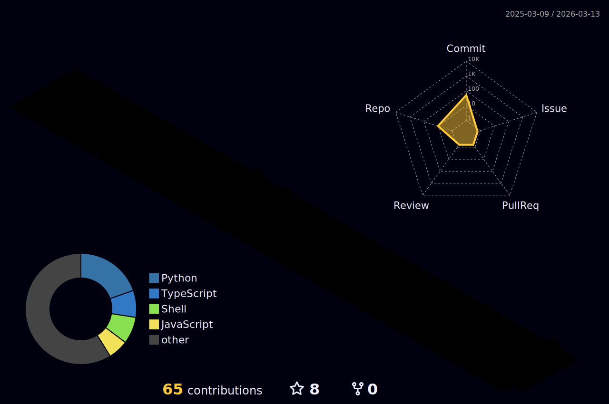

<div align="center">


</div>

---

## 🧑‍💻 About Me

<!--
  ANIMATED ABOUT ME CARD — paste this HTML block into your profile
  Works on GitHub (limited HTML support). For full animation, host as a GitHub Pages site.
-->

<div align="center">

```js
const gaurav = {
  education : "Engineering Student",
  role      : "Full Stack Developer",
  current   : "Building Real World Projects",
  goal      : "Software Engineer @ Top Tech",
  email     : "kumbharegaurav100@gmail.com",
  funFact   : "I love building real world solutions!"
};
```

</div>

> 💡 I'm passionate about bridging the gap between **hardware** and **software** — from embedded systems to cloud-native apps.  
> 🌱 Currently exploring **AI/ML** integrations and building tools that solve real-world problems.  
> 📫 Reach me at **kumbharegaurav100@gmail.com**

---

## 🌐 Connect With Me

<div align="center">

[](https://github.com/gau-rav-001)
[](https://linkedin.com/in/gaurav-kumbhare-8232282a8/)
[](mailto:kumbharegaurav100@gmail.com)
[](https://github.com/gau-rav-001)

</div>

<div align="center">

| 🔗 Platform | 📌 Handle | 💬 Purpose |
|:-----------:|:---------:|:----------:|
| GitHub | [@gau-rav-001](https://github.com/gau-rav-001) | Code & Projects |
| LinkedIn | [Connect Here](https://linkedin.com/in/YOUR-USERNAME) | Professional Network |
| Gmail | [kumbharegaurav100](mailto:kumbharegaurav100@gmail.com) | Direct Contact |

</div>

---

## 🚀 Tech Stack — Icons

<div align="center">

### 💻 Languages


### 🌐 Frontend


### ⚙️ Backend


### 🗄️ Databases


### ☁️ Cloud & Deployment


### 🤖 AI / ML / Data Science

<br/>


### 🛠️ Tools & DevOps


### 🔩 Embedded & Hardware


</div>

---

## 📊 GitHub Stats

<div align="center">


&nbsp;&nbsp;


<br><br>


</div>

---

## 🏆 GitHub Trophies

<div align="center">

</div>

---

## 📈 Contribution Activity

<div align="center">

</div>

---

## 🎮 Unique Contribution Visualizer

<!-- Replace YOUR_GITHUB_TOKEN with a personal access token (read:user scope) in a GitHub Action -->

<div align="center">

> ### 🕹️ My GitHub Contributions — Isometric City
>
> [](https://github.com/gau-rav-001)
>
> **Setup:** Add `.github/workflows/city.yml` with the workflow below ↓

</div>

<details>
<summary>🏙️ <strong>Click to see Isometric City workflow setup</strong></summary>

```yaml
# .github/workflows/city.yml
name: Generate Isometric Contribution City

on:
  schedule:
    - cron: "0 */12 * * *"
  workflow_dispatch:
  push:
    branches: [main]

jobs:
  build:
    runs-on: ubuntu-latest
    permissions:
      contents: write
    steps:
      - uses: actions/checkout@v3

      - name: Generate Isometric City SVG
        uses: yoshi389111/github-profile-3d-contrib@0.7.1
        env:
          GITHUB_TOKEN: ${{ secrets.GITHUB_TOKEN }}
          USERNAME: gau-rav-001

      - name: Commit & Push
        run: |
          git config user.name "github-actions[bot]"
          git config user.email "github-actions[bot]@users.noreply.github.com"
          git add -A
          git diff --cached --quiet || git commit -m "chore: update 3D contribution city"
          git push
```

**What this creates:** A stunning **3D isometric city** where each building's height = your daily commit count. Updated every 12 hours automatically.

After running once, embed it like this in your README:
```markdown

```

</details>

---

## 🏗️ Featured Projects

<div align="center">

<a href="https://github.com/gau-rav-001/Automated-E-certificate-Distribution-System-">
  
</a>
&nbsp;
<a href="https://github.com/gau-rav-001/industrial-dashboard">
  
</a>

<br><br>

<a href="https://github.com/gau-rav-001/FloodShield">
  
</a>

</div>

---

<div align="center">

## 👀 Visitor Counter


<br><br>

⚡ *"Code. Build. Iterate. Ship."* ⚡


</div>
